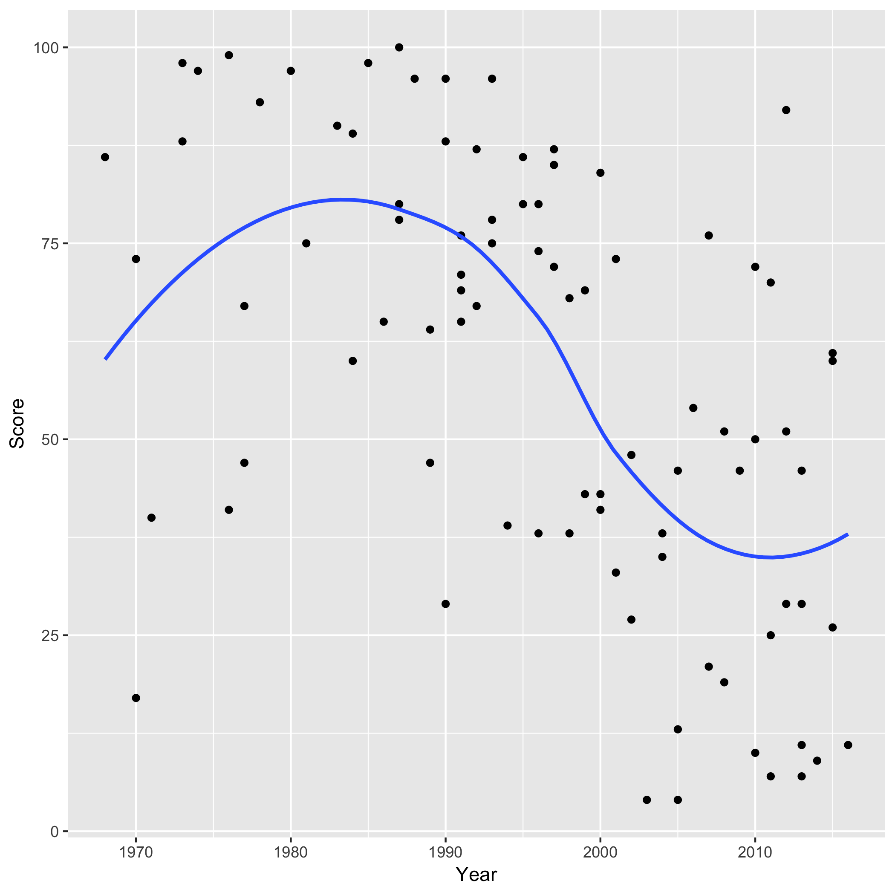

```{r load deniro_dat}
deniro_table <- read.delim("deniro.tsv")
```

Robert De Niro is a great actor. But how have his movies rated over time? To investigate this question, we will look at his Rotten Tomato scores over the years. 

Results were calculated based on data online summarizing the scores each one of his films and their year of release.

The film with the highest score (`r with(deniro_table, Score[which.max(Score)])`) was received in `r with(deniro_table, Year[which.max(Score)])`, and the lowest score (`r with(deniro_table, Score[which.min(Score)])`) was in `r with(deniro_table, Year[which.min(Score)])`

Here is a figure showing how his film scores have wavered over time:


